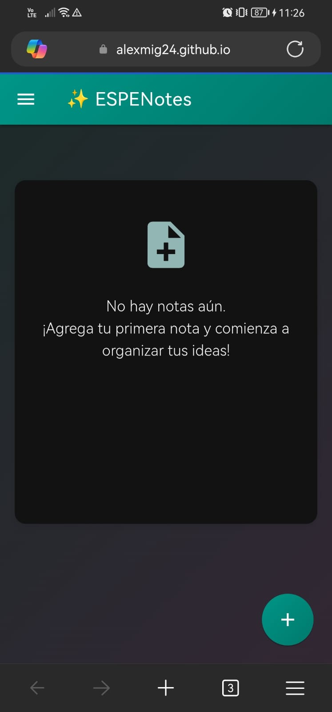
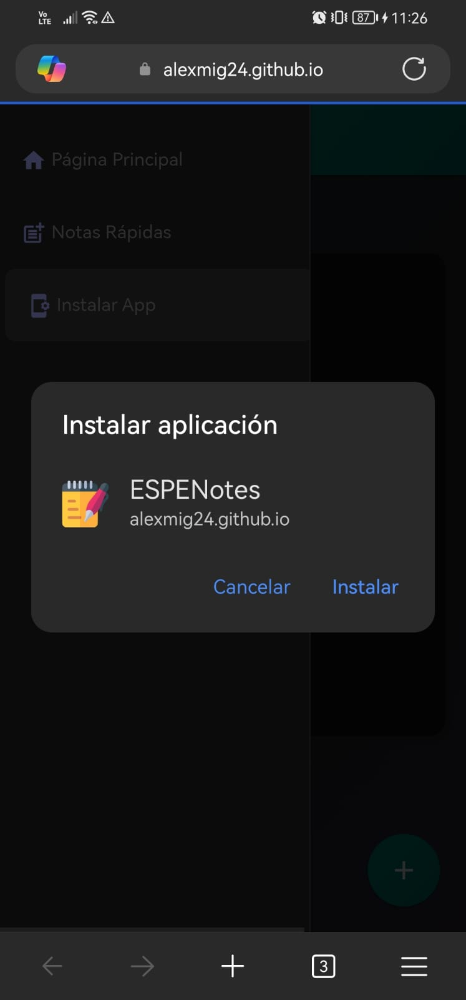
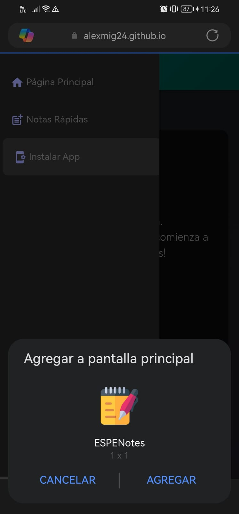
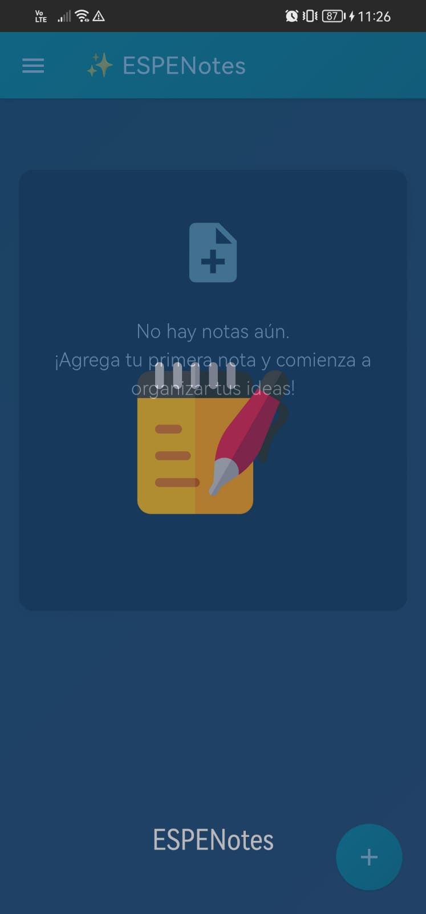
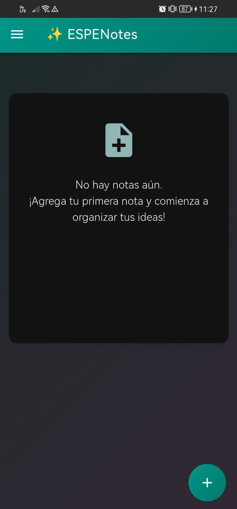
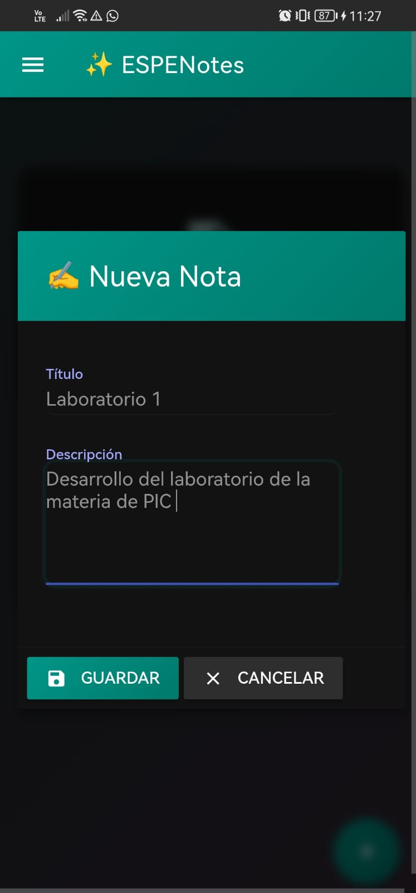
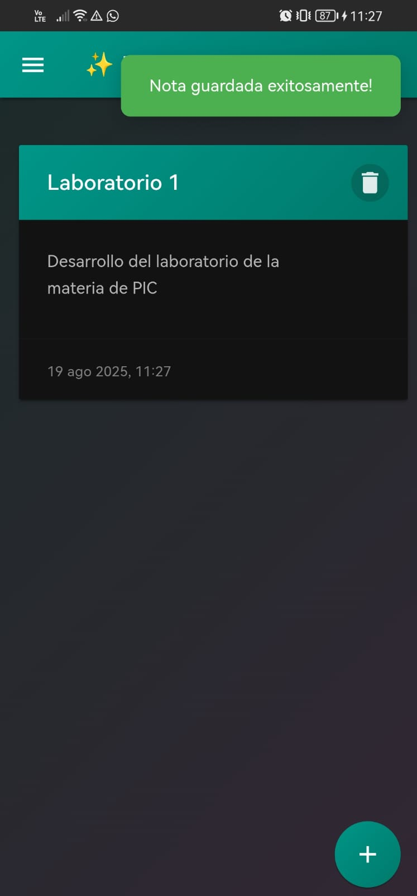
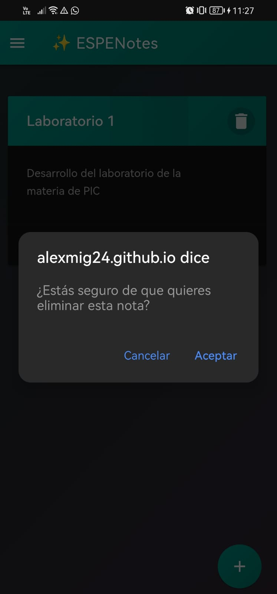
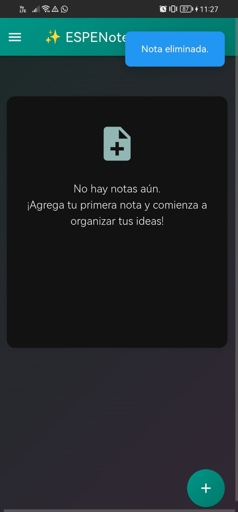

# ESPENotes - Aplicación de Notas PWA

Quick Jot es una aplicación web progresiva (PWA) para tomar notas rápidas que funciona incluso sin conexión a internet. Desarrollada con Material Design Lite, ofrece una experiencia limpia y responsiva.

## Enlace a page de ESPENotes
El enlace se generó mediante GitHub Pages, para acceder y probar el funcionamiento de la PWA, puedes hacerlo meidante este enalce:

```
https://alexmig24.github.io/T3_App_Notes/ 
```

## Características principales

- ✅ Interfaz basada en **Material Design Lite**.  
- ✅ Creación de notas con un formulario simple y botón flotante (FAB).  
- ✅ Visualización de notas en tarjetas (Cards) dinámicas.  
- ✅ Instalación como aplicación PWA en dispositivos móviles y escritorio.  
- ✅ Funcionamiento **offline** gracias a `Service Worker` (estrategia Cache First).  
- ✅ Soporte para **notificaciones push** y **sincronización en segundo plano**.  

## Tecnologías utilizadas

- HTML5
- CSS3
- JavaScript (ES6)
- Material Design Lite
- Service Workers
- Web App Manifest


## Funcionalidades de PWA

- **App Shell precacheado**: index.html, CSS, JS e íconos cacheados en instalación.  
- **Cache First Strategy**: los recursos se sirven desde la caché si están disponibles.  
- **Offline Support**: la app sigue funcionando sin conexión.  
- **Push Notifications**: permite mostrar notificaciones personalizadas.  
- **Background Sync**: preparado para sincronización de datos cuando vuelva la conexión.  

## Requisitos del sistema

- Navegador web moderno (Chrome, Firefox, Edge, Safari)
- Node.js (para desarrollo)

## Instalación y ejecución

1. Clona el repositorio:
```bash
git https://github.com/Alexmig24/T3_App_Notes.git
```

2. Instala las dependecias
```bash
npm install
```

3. Inicia el servidor de desarrollo:
```bash
npm run serve
```

4. Abre tu navegador en:
```bash
http://localhost:8080
```
---
## Cómo usar la aplicación
1. Haz clic en el botón flotante (+) para agregar una nueva nota
2. Completa el título (opcional) y la descripción
3. Haz clic en "Guardar"
4. Para eliminar una nota, haz clic en el ícono de basura en la esquina superior derecha de cada nota

## Funcionamiento offline

La aplicación está diseñada para funcionar sin conexión gracias a:

- Service Worker que cachea los recursos esenciales
- Almacenamiento local de las notas en el navegador
- Estrategia "Cache First" para los recursos estáticos

## 📂 Estructura del Proyecto

```
T3_App_Notes/
│── index.html              # Página principal con la estructura base
│── style.css               # Estilos personalizados
│── app.js                  # Lógica principal de la aplicación
│── manifest.json           # Configuración de la PWA (nombre, íconos, colores)
│── sw.js                   # Service Worker para caché y notificaciones
├── src/
│   ├── css/
│   │   └── app.css         # Estilos adicionales
│   ├── js/
│   │   ├── app.js          # Registro del SW y lógica de notas
│   │   ├── notes.js        # Manejo de las notas
│   │   └── ui.js           # Actualización de la interfaz
│   └── assets/
│       └── icons/          # Íconos para PWA (128x128, 256x256, 512x512)
```

## Capturas de pantalla
- Vista de la PWA desde el navegador.

- Instalación de la PWA al celular mediante la opcino antes configurada


- Apertura de la PWA desde el celular sin navegador.


- Registro de nuevas notas con persistencia ne localStorage


- Eliminación de las notas

